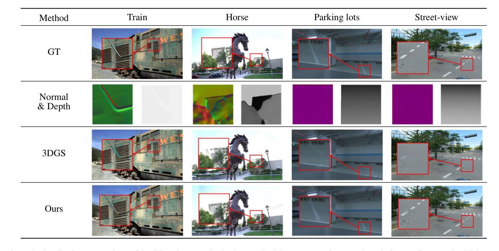

<div align="center">

# Prior-Driven Enhancements in 3D Gaussian Splatting:<br>Normals and Depths Regularization

**ISPRS Geospatial Week 2025 · Oral**

Gyeonggwan Lee · Seunghwan Hong · Junghun Suh

AI R&D Team, Kakao Mobility

[](https://arxiv.org/abs/2609.36969)
[](paper/PDIGS_ISPRS2025.pdf)
[](https://doi.org/10.5194/isprs-archives-XLVIII-G-2025-891-2025)
[](https://gandanlee.github.io/pdigs/)
[](https://huggingface.co/gandan-lee/pdigs)
[](LICENSE.md)

**[Project Page](https://gandanlee.github.io/pdigs/)** · **[arXiv](https://arxiv.org/abs/2609.36969)** · **[Paper](paper/PDIGS_ISPRS2025.pdf)** · **[🤗 Models](https://huggingface.co/gandan-lee/pdigs)** · **[DOI](https://doi.org/10.5194/isprs-archives-XLVIII-G-2025-891-2025)** · **[Reproduce Table 1](docs/REPRODUCE.md)**



</div>

3D Gaussian Splatting starts from a sparse SfM point set and models view-dependent appearance, so in complex scenes — reflective floors, low texture, repetitive road markings — its geometry drifts and artifacts appear. We regularize 3DGS optimization with geometric priors from a monocular estimator (Metric3D):

- **Normal prior** — Gaussians are initialized from the predicted surface normals, and a normal-consistency loss flattens each Gaussian's covariance along the surface normal, $\mathcal{L}_{\text{normal}} = \lambda\mathcal{L}_{\text{axis}} + (1-\lambda)\mathcal{L}_{\text{scale}}$ (following [VEGS](https://vegs3d.github.io/)).
- **Depth prior** — the dense monocular depth is rescaled to the sparse depth of the projected SfM points and supervises the rendered depth, $\mathcal{L}_{\text{depth}} = \lVert D_{\text{guide}} - D \rVert_1$.

We evaluate across three SfM pipelines used for Gaussian initialization — COLMAP (SIFT), SuperPoint + SuperGlue, and LoFTR ([Detector-Free SfM](https://github.com/zju3dv/DetectorFreeSfM)).

## Results

Table 1 of the paper. MRE = mean reprojection error of the SfM point cloud, which both rows of a dataset share. Rendering is scored with PSNR↑, SSIM↑ and LPIPS↓. The baseline is vanilla 3DGS.

| Dataset | Method | COLMAP<br>MRE↓ | PSNR↑ | SSIM↑ | LPIPS↓ | SP-SG<br>MRE↓ | PSNR↑ | SSIM↑ | LPIPS↓ | LoFTR<br>MRE↓ | PSNR↑ | SSIM↑ | LPIPS↓ |
|:--|:--|:-:|:-:|:-:|:-:|:-:|:-:|:-:|:-:|:-:|:-:|:-:|:-:|
| Train | 3DGS | 0.75 | 21.10 | **0.802** | **0.218** | 1.40 | 21.10 | **0.750** | **0.282** | 0.79 | 20.97 | **0.767** | **0.274** |
| | **Ours** | | **21.97** | 0.799 | 0.252 | | **21.32** | 0.749 | 0.287 | | **21.11** | 0.759 | 0.291 |
| Horse | 3DGS | 0.71 | 24.18 | 0.889 | 0.239 | 1.31 | 21.01 | **0.802** | **0.239** | 0.80 | 23.39 | 0.870 | 0.174 |
| | **Ours** | | **25.50** | **0.903** | **0.153** | | **21.12** | 0.801 | 0.246 | | **24.80** | **0.881** | **0.165** |
| Parking lots | 3DGS | invalid | – | – | – | 1.37 | 28.08 | 0.828 | **0.424** | 0.64 | **29.33** | **0.842** | **0.410** |
| | **Ours** | | – | – | – | | **28.37** | **0.829** | 0.427 | | 29.07 | 0.840 | 0.414 |
| Street-view | 3DGS | invalid | – | – | – | 1.09 | 18.33 | 0.468 | **0.410** | 0.56 | 22.28 | **0.729** | **0.331** |
| | **Ours** | | – | – | – | | **19.00** | **0.479** | 0.492 | | **22.49** | 0.722 | 0.340 |

- The priors raise PSNR in 9 of the 10 valid settings. The exception is Parking lots + LoFTR, where artificial-light reflections on the floor blur the priors. SSIM stays comparable, while LPIPS rises in several cases because monocular priors oversmooth high-frequency texture (grass, foliage, gravel).
- COLMAP fails to reconstruct the Parking lots and Street-view scenes. SP-SG and LoFTR both succeed, and LoFTR gives the lower MRE of the two on both scenes.

[`docs/REPRODUCE.md`](docs/REPRODUCE.md) gives the command for every row.

## Installation

```bash
git clone https://github.com/gandanlee/pdigs.git && cd pdigs
conda env create -f environment.yml && conda activate pdigs
pip install submodules/diff-gaussian-rasterization submodules/simple-knn
```

The paper's models were trained on Ubuntu 20.04 with CUDA 11.6 and PyTorch 1.13.1. The rasterizer in `submodules/diff-gaussian-rasterization` is a modified version that also renders depth, alpha, and per-pixel Gaussian rotation and scale. It replaces the stock 3DGS rasterizer, so install this copy.

## Data

A scene is a COLMAP reconstruction plus one normal map per image:

```
<scene>/
├── images/        # undistorted PINHOLE images
├── sparse/0/      # COLMAP cameras / images / points3D
└── normals/       # <image_name>.npy, float32 (3, H, W), camera-space normals
```

`convert.py` turns raw images into this COLMAP layout, as in 3DGS. [`scripts/metric3d/README.md`](scripts/metric3d/README.md) describes how the normals were produced with Metric3D. Tanks and Temples Train and Horse are public. The Parking lots and Street-view scenes are in-house data and are not released.

## Usage

```bash
# train (normal prior on; depth prior off, as in Table 1)
python train.py -s $DATA/sp-sg/Horse -m output/sp-sg/Horse --eval \
    --densify_until_iter 20000 --size_threshold_from_iter -1

# render the test views and score them
python render.py  -m output/sp-sg/Horse --skip_train
python metrics.py -m output/sp-sg/Horse

# all "Ours" rows of Table 1
DATA=/path/to/data ./scripts/train_table1.sh
```

Options added on top of 3DGS (`arguments/__init__.py`):

| Option | Default | Meaning |
|:--|:-:|:--|
| `--lambda_dnormal` | `1e-4` | weight of $\mathcal{L}_{\text{normal}}$ |
| `--lambda_normal_axis` | `0.8` | $\lambda$ in $\mathcal{L}_{\text{normal}} = \lambda\mathcal{L}_{\text{axis}} + (1-\lambda)\mathcal{L}_{\text{scale}}$ |
| `--normal_loss_until_iter` | `-1` | apply $\mathcal{L}_{\text{normal}}$ only before this iteration (`-1`: always) |
| `--no_normal_init` | off | skip the initialization from normals |
| `--depth_use` | off | enable the dense depth prior |
| `--depth_model_type` | `zoe` | depth network for the depth prior: `zoe` or `metric3d` |
| `--lambda_depth` | `0.5` | weight of $\mathcal{L}_{\text{depth}}$ |
| `--size_threshold_from_iter` | `3000` | start screen-size pruning after this iteration (`-1`: never) |

Densification (`--densify_until_iter`, `--size_threshold_from_iter`) was tuned per scene. The values are in [`docs/REPRODUCE.md`](docs/REPRODUCE.md).

## Repository

| Path | Contents |
|:--|:--|
| `train.py` | training with the normal and depth priors |
| `loss/normal_guidance.py` | normal-consistency loss |
| `utils/norminit_utils.py` | Gaussian initialization from normals |
| `utils/depth_utils.py` | dense depth prior and its scale alignment to SfM depth |
| `scene/`, `gaussian_renderer/`, `utils/`, `render.py`, `metrics.py`, `convert.py` | 3DGS, with scene loading extended to normal priors |
| `submodules/` | modified `diff-gaussian-rasterization` and `simple-knn` |
| `scripts/` | Table 1 training script, Metric3D normal export |
| `tests/` | CPU tests of the normal loss (`python -m pytest tests`) |
| `docs/` | [reproduction](docs/REPRODUCE.md), [trained models](docs/CHECKPOINTS.md), project page |
| `paper/` | the published paper |

## Citation

```bibtex
@article{lee2025prior,
  title   = {Prior-Driven Enhancements in {3D} {Gaussian} Splatting: Normals and Depths Regularization},
  author  = {Lee, Gyeonggwan and Hong, Seunghwan and Suh, Junghun},
  journal = {The International Archives of the Photogrammetry, Remote Sensing and Spatial Information Sciences},
  volume  = {XLVIII-G-2025},
  pages   = {891--897},
  year    = {2025},
  doi     = {10.5194/isprs-archives-XLVIII-G-2025-891-2025},
  eprint  = {2609.36969},
  archivePrefix = {arXiv},
  primaryClass = {cs.CV},
  note    = {ISPRS Geospatial Week 2025, Dubai, UAE}
}
```

## Acknowledgements

This work was supported by the Institute of Information & communications Technology Planning & Evaluation (IITP) grant funded by the Korea government (MSIT) (No. RS-2023-00229833, Development of Intelligent Teleoperation Technology for Cloud-based Autonomous Vehicle Errors and Limit Situation), and by Kakao Mobility.

The code builds on [3D Gaussian Splatting](https://github.com/graphdeco-inria/gaussian-splatting) (Inria / MPII). The normal-prior initialization, the normal-consistency loss and the rasterizer extensions come from [VEGS](https://github.com/deepshwang/vegs) (Hwang et al., ECCV 2024) and its rasterizer [diff_gaussian_rasterization_with_depth](https://github.com/emjay73/diff_gaussian_rasterization_with_depth). The depth-prior alignment follows Chung et al., *Depth-regularized optimization for 3D Gaussian Splatting in few-shot images* (CVPR 2024 Workshops). The normals come from [Metric3D](https://github.com/YvanYin/Metric3D).

The code is released under the [Gaussian-Splatting License](LICENSE.md) (non-commercial research and evaluation use), inherited from 3DGS. The paper is © the authors, [CC BY 4.0](https://creativecommons.org/licenses/by/4.0/).
